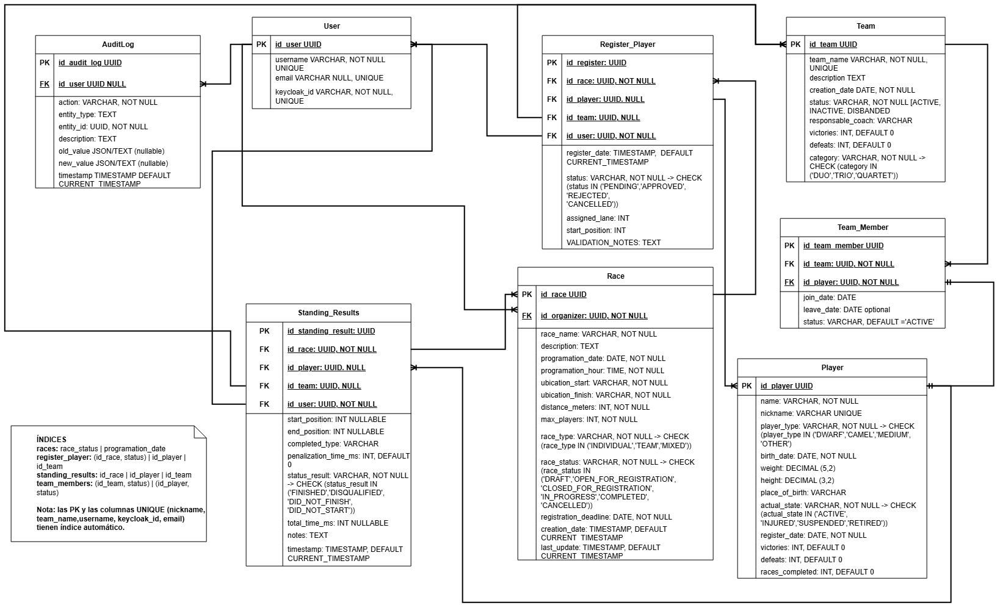

# The Great EIA Camel vs. Dwarf Racing System

Sistema de información para la liga ficticia de carreras entre camellos y enanos de la
Universidad EIA. Permite administrar competidores, equipos, carreras, inscripciones y
resultados, con autenticación y autorización por roles, interfaz web y despliegue
completo en contenedores.

> Proyecto académico de la asignatura **Integración e Implementación de Software**.
> Universidad EIA · Instructor: Sebastián Zapata Ramírez.

---

## Tabla de contenido

1. [Integrantes](#integrantes)
2. [Arquitectura](#arquitectura)
3. [Tecnologías](#tecnologías)
4. [Modelo de datos](#modelo-de-datos)
5. [Estrategia de seguridad](#estrategia-de-seguridad)
6. [Roles y permisos](#roles-y-permisos)
7. [Puesta en marcha con Docker](#puesta-en-marcha-con-docker)
8. [Instalación para desarrollo](#instalación-para-desarrollo)
9. [Variables de entorno](#variables-de-entorno)
10. [URLs y puertos](#urls-y-puertos)
11. [Usuarios de ejemplo](#usuarios-de-ejemplo)
12. [Datos iniciales](#datos-iniciales)
13. [Módulos y reglas de negocio](#módulos-y-reglas-de-negocio)
14. [API REST](#api-rest)
15. [Peticiones de ejemplo](#peticiones-de-ejemplo)
16. [Pruebas automatizadas](#pruebas-automatizadas)
17. [Limitaciones conocidas](#limitaciones-conocidas)
18. [Mejoras futuras](#mejoras-futuras)

---

## Integrantes

| Integrante                  | GitHub                                      | Responsabilidades principales                                                                         |
| --------------------------- | ------------------------------------------- | ----------------------------------------------------------------------------------------------------- |
| Isaac Camilo Giraldo Gómez | [@IsaksGir4](https://github.com/IsaksGir4)   | Competidores, equipos, carreras, inscripciones, resultados y clasificación. Interfaz web.            |
| José Julio Jaller          | [@JulioJoseJ](https://github.com/JulioJoseJ) | Seguridad con Keycloak, sincronización de usuarios, registro de auditoría e infraestructura Docker. |

---

## Arquitectura

El sistema se compone de cuatro servicios independientes que se comunican a través de
una red aislada de Docker.

```
Navegador
    │
    ├──────────────► Frontend (React + nginx, :5173)
    │                     │
    │                     │ REST + Bearer token
    │                     ▼
    ├──────────────► Backend (Spring Boot, :8080)
    │                     │
    │                     ├──► PostgreSQL (:5433)
    │                     └──► Keycloak (validación de JWT)
    │
    └──────────────► Keycloak (:8180)   login / obtención del token
```

El navegador obtiene el token directamente de Keycloak mediante OpenID Connect con PKCE;
el backend nunca ve credenciales, solo valida la firma del JWT contra el JWKS del realm.

### Backend: arquitectura por capas

```
controller/     Recibe peticiones HTTP, valida el formato de entrada y devuelve
                respuestas. No contiene lógica de negocio.
service/        Implementa las reglas de negocio y coordina repositorios.
repository/     Acceso a datos con Spring Data JPA.
  specification/  Filtros dinámicos y componibles para las búsquedas.
entity/         Entidades JPA y enumeraciones del dominio.
dto/            Contratos de la API (records). Las entidades nunca se exponen.
exception/      Manejo centralizado de errores con respuestas consistentes.
config/         Configuración de seguridad y carga de datos iniciales.
```

### Frontend: responsabilidades

```
routes/         Páginas, con enrutamiento basado en archivos.
components/     Elementos reutilizables (layout, formularios, tablas, estados).
  ui/           Primitivas de interfaz (shadcn/ui).
lib/
  keycloak.ts   Cliente OIDC.
  auth.tsx      Contexto de sesión, roles y permisos.
  api.ts        Cliente HTTP: adjunta el token, refresca y normaliza errores.
  league-api.ts Capa de adaptación entre los DTO del backend y la vista.
```

`league-api.ts` concentra el conocimiento del contrato de la API: si el backend cambia el
nombre de un campo, solo se modifica ese archivo.

---

## Tecnologías

**Backend:** Java 21, Spring Boot, Spring Web, Spring Data JPA, Spring Validation,
Spring Security (OAuth2 Resource Server), Lombok, Gradle.

**Base de datos:** PostgreSQL 15. H2 en memoria únicamente para las pruebas.

**Seguridad:** Keycloak 26 como proveedor de identidad.

**Frontend:** React 18, TypeScript, Vite, TanStack Router, TanStack Query, Tailwind CSS 4,
shadcn/ui, react-hook-form, Zod, keycloak-js.

**Infraestructura:** Docker y Docker Compose, nginx para servir el frontend compilado.

**Pruebas:** JUnit 5, Mockito, AssertJ.

**Integración continua:** GitHub Actions ejecuta la batería de pruebas en cada pull request.

---

## Modelo de datos



| Tabla                | Descripción                                                                   |
| -------------------- | ------------------------------------------------------------------------------ |
| `users`            | Espejo local de las identidades de Keycloak (`keycloak_id` = claim `sub`). |
| `players`          | Competidores: enanos, camellos, medianos u otros.                              |
| `teams`            | Equipos, con categoría que determina el número máximo de miembros.          |
| `team_members`     | Pertenencia de un competidor a un equipo, con historial de alta y baja.        |
| `races`            | Carreras, con su máquina de estados.                                          |
| `register_player`  | Inscripciones. Un registro apunta a un competidor**o** a un equipo.      |
| `standing_results` | Resultados oficiales de cada carrera.                                          |
| `audit_logs`       | Registro de las acciones relevantes del sistema.                               |

**Integridad:** claves primarias UUID, claves foráneas con integridad referencial,
restricciones de unicidad (`nickname`, `team_name`, `username`, `keycloak_id`),
restricciones `CHECK` generadas a partir de las enumeraciones y una restricción XOR en
`register_player` y `standing_results` que garantiza que el participante sea un
competidor o un equipo, nunca ambos ni ninguno.

**Índices:** además de los automáticos de claves primarias y columnas únicas, se declaran
índices sobre las columnas que más se consultan:

```
races:            race_status | programation_date
register_player:  (id_race, status) | id_player | id_team
standing_results: id_race | id_player | id_team
team_members:     (id_team, status) | (id_player, status)
```

**Persistencia:** la base de datos usa el volumen nombrado `postgres_data`, de modo que
los datos sobreviven al reinicio de los contenedores.

---

## Estrategia de seguridad

La autenticación se delega en **Keycloak**, que actúa como proveedor de identidad. El
backend funciona como *resource server*: no almacena contraseñas ni emite tokens, solo
valida los que recibe.

**Flujo de autenticación**

1. El usuario inicia sesión en la interfaz, que lo redirige a Keycloak.
2. Keycloak autentica y devuelve un *access token* (JWT) mediante Authorization Code Flow
   con PKCE (S256).
3. El frontend adjunta el token en cada petición como `Authorization: Bearer <token>`.
4. El backend valida la firma contra el JWKS del realm y extrae los roles del claim
   `realm_access.roles`, mapeándolos a autoridades de Spring (`ROLE_ADMIN`, etc.).
5. Cada endpoint declara sus permisos con `@PreAuthorize`.

**Sincronización de usuarios.** La primera vez que un usuario autenticado realiza una
acción, `UserSyncService` crea una fila local en `users` enlazada por `keycloak_id`. Esto
permite asociar carreras, inscripciones, resultados y auditoría a un usuario sin duplicar
la gestión de credenciales.

**Medidas aplicadas**

- Tokens con expiración (30 minutos) y renovación automática en el cliente.
- Sesiones sin estado en el backend (`STATELESS`).
- Autorización por roles en cada endpoint y ocultamiento de acciones en la interfaz.
- `401` para peticiones sin autenticación o con token inválido; `403` para usuarios
  autenticados sin permiso. Ambos con cuerpo JSON estructurado.
- CORS restringido al origen del frontend, configurable por variable de entorno.
- Las contraseñas nunca viajan por la API ni se almacenan en la base de datos de la
  aplicación; las gestiona Keycloak con su propio cifrado.
- Ningún secreto está versionado: el repositorio incluye `.env.example` sin credenciales
  reales y `.env` está excluido en `.gitignore`.
- Los errores nunca exponen trazas de pila.

---

## Roles y permisos

| Acción                                                    | ADMIN | ORGANIZER | VIEWER |
| ---------------------------------------------------------- | :---: | :-------: | :----: |
| Consultar competidores, equipos, carreras y clasificación |  ✅  |    ✅    |   ✅   |
| Crear, editar y eliminar competidores                      |  ✅  |    ❌    |   ❌   |
| Cambiar el estado de un competidor                         |  ✅  |    ❌    |   ❌   |
| Crear, editar y eliminar equipos                           |  ✅  |    ❌    |   ❌   |
| Gestionar miembros de un equipo                            |  ✅  |    ❌    |   ❌   |
| Crear y editar carreras                                    |  ✅  |    ✅    |   ❌   |
| Cambiar el estado de una carrera                           |  ✅  |    ✅    |   ❌   |
| Inscribir, aprobar y rechazar participantes                |  ✅  |    ✅    |   ❌   |
| Registrar y modificar resultados                           |  ✅  |    ✅    |   ❌   |
| Consultar el registro de auditoría                        |  ✅  |    ❌    |   ❌   |

En la interfaz, los botones y las opciones de menú sin permiso no se muestran, y las
rutas están protegidas: acceder por URL a una sección restringida lleva a la pantalla de
acceso denegado.

---

## Puesta en marcha con Docker

**Requisitos:** Docker Desktop (o Docker Engine con Compose v2).

```bash
git clone https://github.com/IsaksGir4/CamelsVsDwarfs.git
cd CamelsVsDwarfs
cp .env.example .env
docker compose up -d --build
```

La primera construcción tarda unos minutos porque compila el backend con Gradle y el
frontend con Vite. Cuando termine, los cuatro contenedores deben aparecer como `healthy`:

```bash
docker compose ps
```

Abre **http://localhost:5173** e inicia sesión con cualquiera de los
[usuarios de ejemplo](#usuarios-de-ejemplo).

**Detener el sistema**

```bash
docker compose down       # conserva los datos
docker compose down -v    # elimina también el volumen de la base de datos
```

> Tras `down -v`, al volver a levantar el sistema los datos iniciales se cargan de nuevo
> automáticamente.

---

## Instalación para desarrollo

**Backend**

```bash
cd backend
./gradlew clean build
./gradlew bootRun          # requiere postgres y keycloak levantados
```

**Frontend**

```bash
cd frontend
npm install
npm run dev                # servidor de desarrollo en :5173
```

Para el modo de desarrollo, crea `frontend/.env`:

```
VITE_KEYCLOAK_URL=http://localhost:8180
VITE_KEYCLOAK_REALM=camelsvsdwarfs
VITE_KEYCLOAK_CLIENT_ID=camelsvsdwarfs-frontend
VITE_API_BASE_URL=http://localhost:8080/api
```

---

## Variables de entorno

Archivo `.env` en la raíz del proyecto (plantilla en `.env.example`):

| Variable                    | Descripción                              | Valor por defecto         |
| --------------------------- | ----------------------------------------- | ------------------------- |
| `DB_NAME`                 | Nombre de la base de datos                | `camelsvsdwarfsdb`      |
| `DB_USER`                 | Usuario de PostgreSQL                     | `camelsvsdwarfsuser`    |
| `DB_PASSWORD`             | Contraseña de PostgreSQL                 | `changeme`              |
| `DB_PORT`                 | Puerto publicado de PostgreSQL            | `5433`                  |
| `KEYCLOAK_PORT`           | Puerto publicado de Keycloak              | `8180`                  |
| `KEYCLOAK_ADMIN_USER`     | Usuario administrador de Keycloak         | `admin`                 |
| `KEYCLOAK_ADMIN_PASSWORD` | Contraseña del administrador de Keycloak | `admin`                 |
| `FRONTEND_PORT`           | Puerto publicado del frontend             | `5173`                  |
| `FRONTEND_URL`            | Origen permitido por CORS en el backend   | `http://localhost:5173` |

> El archivo `.env` está excluido del control de versiones. Los valores de ejemplo son
> para desarrollo local y deben cambiarse en cualquier despliegue real.

---

## URLs y puertos

| Componente          | URL                                   | Puerto       |
| ------------------- | ------------------------------------- | ------------ |
| Interfaz web        | http://localhost:5173                 | 5173 → 80   |
| API REST            | http://localhost:8080/api             | 8080         |
| Estado del backend  | http://localhost:8080/actuator/health | 8080         |
| Consola de Keycloak | http://localhost:8180                 | 8180 → 8080 |
| PostgreSQL          | `localhost:5433`                    | 5433 → 5432 |

---

## Usuarios de ejemplo

Se importan automáticamente con el realm de Keycloak.

| Usuario       | Contraseña      | Rol                     |
| ------------- | ---------------- | ----------------------- |
| `admin`     | `admin123`     | Administrador           |
| `organizer` | `organizer123` | Organizador de carreras |
| `viewer`    | `viewer123`    | Espectador              |

---

## Datos iniciales

Al arrancar con la base de datos vacía, `DataSeeder` carga:

- Los tres usuarios locales enlazados a las identidades de Keycloak.
- Cinco enanos: Null Pointer, Stack Overflow, Little Lambda, Captain Cache y Tiny Docker.
- Dos camellos: Byte y Kernel Panic.
- Dos competidores de tamaño medio: Merge Conflict y Race Condition.
- Dos equipos: The Five Exceptions (cuarteto, completo) y Runtime Rebels (trío).
- Tres carreras en estados distintos: borrador, inscripciones abiertas y finalizada.
- Una carrera finalizada con sus resultados oficiales, incluido el memorable abandono de
  Tiny Docker a mitad de recorrido porque «funcionaba en su máquina».

La carga es idempotente: si ya existen competidores, el proceso no hace nada.

---

## Módulos y reglas de negocio

### Competidores

Alta, consulta, edición, cambio de estado y baja, con filtros por tipo y estado, búsqueda
por nombre, ordenamiento y paginación.

- El apodo es único en todo el sistema.
- El peso y la altura deben ser positivos.
- Solo los competidores `ACTIVE` pueden inscribirse en carreras.
- Un competidor con resultados oficiales no se puede eliminar: debe retirarse.

Estados: `ACTIVE`, `INJURED`, `SUSPENDED`, `RETIRED`.
Tipos: `DWARF`, `CAMEL`, `MEDIUM`, `OTHER`.

### Equipos

Alta, consulta, edición, cambio de estado, baja y gestión de miembros.

- El nombre del equipo es único.
- Un competidor no puede pertenecer a dos equipos activos a la vez.
- No se puede agregar dos veces al mismo competidor.
- La categoría determina el máximo de miembros: `DUO` (2), `TRIO` (3), `QUARTET` (4).
- No se puede reducir la categoría por debajo del número de miembros activos.
- Un equipo necesita al menos un competidor para inscribirse en una carrera.
- Un equipo con historial de resultados no se puede eliminar: debe desactivarse.

Estados: `ACTIVE`, `INACTIVE`, `DISBANDED`.

### Carreras

Alta, consulta, edición, transición de estados y baja, con filtros por estado, tipo,
nombre y fecha.

**Máquina de estados.** Solo se permiten estas transiciones:

```
DRAFT ──► OPEN_FOR_REGISTRATION ──► CLOSED_FOR_REGISTRATION ──► IN_PROGRESS ──► COMPLETED
                                              │
                                              └──► OPEN_FOR_REGISTRATION (reapertura)

Desde cualquier estado no final ──► CANCELLED
```

`COMPLETED` y `CANCELLED` son estados finales: una carrera completada no vuelve a
borrador, aunque el camello pida la revancha.

- La carrera no puede programarse en el pasado (se comparan fecha y hora).
- El cierre de inscripciones debe ser anterior a la fecha de la carrera.
- La distancia debe ser mayor que cero y se requieren al menos dos participantes.
- Una carrera en curso, finalizada o cancelada no se puede editar.
- No se puede reducir el cupo por debajo de las inscripciones activas, ni cambiar el tipo
  de carrera cuando ya hay inscritos.
- Para iniciar se exigen al menos dos inscripciones aprobadas.
- Para finalizar se exige al menos un resultado oficial registrado.
- Solo se pueden eliminar carreras en borrador; el resto se cancelan.

### Inscripciones

- Solo se admiten mientras la carrera está abierta y antes de la fecha límite.
- El tipo de inscripción debe coincidir con el tipo de carrera: `INDIVIDUAL` solo admite
  competidores, `TEAM` solo equipos y `MIXED` ambos.
- No se puede exceder el cupo. **Un equipo ocupa una sola plaza.**
- Un competidor o equipo no puede inscribirse dos veces en la misma carrera.
- Un competidor no puede competir a la vez como individual y como miembro de un equipo en
  la misma carrera.
- Todos los miembros de un equipo inscrito deben estar `ACTIVE`.
- Las posiciones de salida no se duplican; al aprobar se asigna la primera libre.
- El rechazo exige un motivo, que queda registrado en la inscripción.
- La baja de una inscripción es lógica: se marca como `CANCELLED` y se conserva el
  historial.

Estados: `PENDING`, `APPROVED`, `REJECTED`, `CANCELLED`.

### Resultados y clasificación

- Los resultados solo se registran en carreras `IN_PROGRESS`.
- Solo pueden recibir resultado los participantes con inscripción `APPROVED`.
- Un participante no puede tener dos resultados en la misma carrera.
- Las posiciones finales no se duplican entre los que terminan.
- Un resultado `FINISHED` exige tiempo positivo y posición válida.
- Un participante descalificado no puede ocupar el primer puesto.
- Los resultados `DID_NOT_FINISH` y `DID_NOT_START` no llevan posición final.
- Modificar un resultado recalcula las estadísticas desde cero, de forma idempotente, por
  lo que las victorias y derrotas nunca se duplican.

Estados: `FINISHED`, `DISQUALIFIED`, `DID_NOT_FINISH`, `DID_NOT_START`.

**Sistema de puntos**

| Posición                  | Puntos |
| -------------------------- | ------ |
| 1.º                       | 10     |
| 2.º                       | 7      |
| 3.º                       | 5      |
| 4.º                       | 3      |
| 5.º                       | 1      |
| No termina o descalificado | 0      |

### Interfaz gráfica

Pantallas disponibles: inicio de sesión, panel general, listado y detalle de competidores,
formulario de alta y edición de competidores, listado y detalle de equipos con gestión de
miembros, listado y detalle de carreras, formulario de carreras, gestión de inscripciones,
registro de resultados, clasificación, registro de auditoría, acceso denegado y página no
encontrada.

Comportamiento transversal: estados de carga, vacío y error en todas las vistas;
validación por campo antes de enviar; traducción de los errores de la API a mensajes
comprensibles; confirmación en las acciones destructivas; notificaciones de éxito y
error; modo claro y oscuro; y diseño responsive.

### Registro de auditoría

Se registran automáticamente las acciones relevantes: creación, edición, cambio de estado
y eliminación de competidores, equipos y carreras; alta y baja de miembros; creación,
aprobación, rechazo y cancelación de inscripciones; y registro y modificación de
resultados. Cada entrada guarda el usuario, la acción, el tipo y el identificador de la
entidad, una descripción, los valores anterior y nuevo cuando aplica, y la marca de
tiempo. Solo el administrador puede consultarlo.

---

## API REST

Todos los endpoints requieren `Authorization: Bearer <token>`.

### Competidores

```
POST   /api/players                    Crear
GET    /api/players                    Listar (playerType, actualState, name, page, size, sort)
GET    /api/players/{id}               Consultar
PUT    /api/players/{id}               Actualizar
PATCH  /api/players/{id}/status        Cambiar estado
DELETE /api/players/{id}               Eliminar
```

### Equipos

```
POST   /api/teams                      Crear
GET    /api/teams                      Listar (status, name, page, size, sort)
GET    /api/teams/{id}                 Consultar
PUT    /api/teams/{id}                 Actualizar
PATCH  /api/teams/{id}/status          Cambiar estado
DELETE /api/teams/{id}                 Eliminar
GET    /api/teams/{teamId}/members     Miembros activos
POST   /api/teams/{teamId}/members/{competitorId}      Agregar miembro
DELETE /api/teams/{teamId}/members/{competitorId}      Retirar miembro
```

### Carreras

```
POST   /api/races                      Crear
GET    /api/races                      Listar (status, type, name, scheduledAfter, page, size)
GET    /api/races/{id}                 Consultar
PUT    /api/races/{id}                 Actualizar
PATCH  /api/races/{id}/status          Cambiar estado
DELETE /api/races/{id}                 Eliminar
```

### Inscripciones

```
POST   /api/races/{raceId}/registrations      Inscribir
GET    /api/races/{raceId}/registrations      Listar (status)
GET    /api/registrations/{id}                Consultar
PATCH  /api/registrations/{id}/approve        Aprobar
PATCH  /api/registrations/{id}/reject         Rechazar (requiere motivo)
DELETE /api/registrations/{id}                Cancelar
```

### Resultados y clasificación

```
POST   /api/races/{raceId}/results     Registrar resultado
GET    /api/races/{raceId}/results     Resultados de la carrera
GET    /api/results/{id}               Consultar
PUT    /api/results/{id}               Modificar
GET    /api/standings                  Clasificación completa
GET    /api/standings/competitors      Clasificación de competidores
GET    /api/standings/teams            Clasificación de equipos
```

### Perfil y auditoría

```
GET    /api/auth/profile               Perfil del usuario autenticado
GET    /api/audit                      Registro de auditoría (solo ADMIN)
```

### Códigos de estado

| Código | Situación                                                                    |
| ------- | ----------------------------------------------------------------------------- |
| `200` | Consulta o actualización correcta                                            |
| `201` | Recurso creado (incluye cabecera`Location`)                                 |
| `204` | Eliminación correcta sin cuerpo de respuesta                                 |
| `400` | Petición inválida: validación, identificador mal formado o cuerpo ilegible |
| `401` | Falta autenticación o el token no es válido                                 |
| `403` | Usuario autenticado sin permisos suficientes                                  |
| `404` | El recurso no existe                                                          |
| `409` | Conflicto con una regla de negocio                                            |

### Formato de error

Todos los errores comparten la misma estructura:

```json
{
  "timestamp": "2026-09-13T14:30:00",
  "status": 409,
  "error": "Conflict",
  "message": "El competidor ya pertenece activamente a otro equipo.",
  "path": "/api/teams/3c35a074-abca-43c1-bef6-6d9a8e6b42e7/members/b3ec8303-a9a3-4f18-895f-3c7d149744e7"
}
```

---

## Peticiones de ejemplo

**Obtener un token**

```bash
curl -X POST http://localhost:8180/realms/camelsvsdwarfs/protocol/openid-connect/token \
  -H "Content-Type: application/x-www-form-urlencoded" \
  -d "grant_type=password" \
  -d "client_id=camelsvsdwarfs-swagger" \
  -d "username=admin" \
  -d "password=admin123"
```

**Listar competidores**

```bash
curl -H "Authorization: Bearer $TOKEN" \
  "http://localhost:8080/api/players?playerType=DWARF&page=0&size=10"
```

**Crear un competidor**

```bash
curl -X POST http://localhost:8080/api/players \
  -H "Authorization: Bearer $TOKEN" \
  -H "Content-Type: application/json" \
  -d '{
    "name": "Tiny Docker",
    "nickname": "tinydocker",
    "playerType": "DWARF",
    "birthDate": "2000-05-17",
    "height": 1.20,
    "weight": 55.0,
    "placeOfBirth": "Itagui"
  }'
```

**Crear una carrera**

```bash
curl -X POST http://localhost:8080/api/races \
  -H "Authorization: Bearer $TOKEN" \
  -H "Content-Type: application/json" \
  -d '{
    "raceName": "Gran Premio Alto de Las Palmas",
    "description": "Un kilometro de gloria",
    "programationDate": "2026-12-01",
    "programationHour": "10:00:00",
    "ubicationStart": "Campus EIA Zuniga",
    "ubicationFinish": "Campus EIA Alto de Las Palmas",
    "distanceMeters": 1000,
    "maxPlayers": 6,
    "raceType": "MIXED",
    "registrationDeadline": "2026-11-25"
  }'
```

**Inscribir y aprobar**

```bash
curl -X POST http://localhost:8080/api/races/$RACE_ID/registrations \
  -H "Authorization: Bearer $TOKEN" \
  -H "Content-Type: application/json" \
  -d '{"playerId": "'$PLAYER_ID'"}'

curl -X PATCH http://localhost:8080/api/registrations/$REGISTRATION_ID/approve \
  -H "Authorization: Bearer $TOKEN"
```

**Registrar un resultado**

```bash
curl -X POST http://localhost:8080/api/races/$RACE_ID/results \
  -H "Authorization: Bearer $TOKEN" \
  -H "Content-Type: application/json" \
  -d '{
    "playerId": "'$PLAYER_ID'",
    "statusResult": "FINISHED",
    "endPosition": 1,
    "totalTimeMs": 214500,
    "penalizationTimeMs": 0,
    "notes": "Ganador indiscutible"
  }'
```

**Errores esperables**

```bash
# 401: sin token
curl -i http://localhost:8080/api/players

# 403: viewer intentando crear
curl -i -X POST http://localhost:8080/api/players \
  -H "Authorization: Bearer $TOKEN_VIEWER" \
  -H "Content-Type: application/json" -d '{...}'

# 409: apodo duplicado, transición de estado no permitida, cupo agotado…
```

En la raíz del repositorio se incluye una colección de Postman con todos los endpoints y
estos casos de error.

---

## Pruebas automatizadas

```bash
cd backend
./gradlew clean test
```

El informe HTML queda en `backend/build/reports/tests/test/index.html`.

Las pruebas usan H2 en memoria con el perfil `test`, por lo que no requieren Docker ni
tocan la base de datos real. Se cubren, entre otros casos: creación válida de
competidores, rechazo por peso inválido y por apodo duplicado, creación de carreras,
rechazo de carreras en el pasado, inscripción de competidores activos, rechazo de
competidores suspendidos, inscripciones duplicadas, inscripciones fuera de plazo, registro
de resultados, prevención de dos ganadores, transiciones de estado no permitidas y
recursos inexistentes.

GitHub Actions ejecuta esta misma batería en cada pull request.

---

## Limitaciones conocidas

- **Rutas de competidores.** El enunciado sugiere `/api/competitors`; la implementación usa
  `/api/players`, por coherencia con la entidad `Player` del modelo. La funcionalidad es
  la indicada.
- **Gestión de roles.** Los roles se asignan desde la consola de Keycloak. No se
  implementó un endpoint propio de administración de roles, que habría requerido un
  *service account* con acceso a la Admin REST API.
- **Persistencia de Keycloak.** Se ejecuta en modo `start-dev`, que guarda su estado en
  una base H2 interna sin volumen. Los usuarios y roles se recrean en cada arranque a
  partir del realm importado, por lo que los cambios hechos a mano en la consola no
  sobreviven a `docker compose down`. Para que las identidades sean estables, los
  identificadores de los tres usuarios están fijados en el archivo del realm.
- **Capacidad de las carreras.** Un equipo inscrito ocupa una sola plaza del cupo, no
  tantas como miembros tenga.
- **Estados de equipo.** El enunciado menciona equipos «suspendidos»; el modelo usa
  `INACTIVE` y `DISBANDED`. La regla se cumple igual: solo los equipos `ACTIVE` compiten.
- **Edición de resultados.** El endpoint `PUT /api/results/{id}` existe y funciona, pero
  todavía no tiene pantalla propia en la interfaz.
- **Clasificación de equipos.** Se calcula correctamente, pero aparece vacía hasta que
  algún equipo obtenga resultados oficiales en una carrera.

---

## Mejoras futuras

- Endpoint de gestión de roles con *service account* de Keycloak y un superadministrador
  capaz de promover a otros administradores.
- Pantalla de edición de resultados y de corrección de posiciones.
- Exportación de resultados y clasificaciones a CSV o PDF.
- Migraciones versionadas con Flyway en lugar de `ddl-auto: update`.
- Pruebas de integración con Testcontainers y pruebas end-to-end de la interfaz.
- Keycloak en modo producción con base de datos persistente propia.
- Notificaciones en tiempo real del estado de las carreras mediante WebSockets.
- Despliegue en la nube con pipeline de construcción y publicación de imágenes.

---

## Licencia

Proyecto académico sin fines comerciales. Universidad EIA, 2026.

> Advertencia académica: esta historia es ficticia, intencionalmente absurda y diseñada
> exclusivamente con fines educativos. Ningún camello, enano ni hoja de cálculo resultó
> herido durante el desarrollo.
